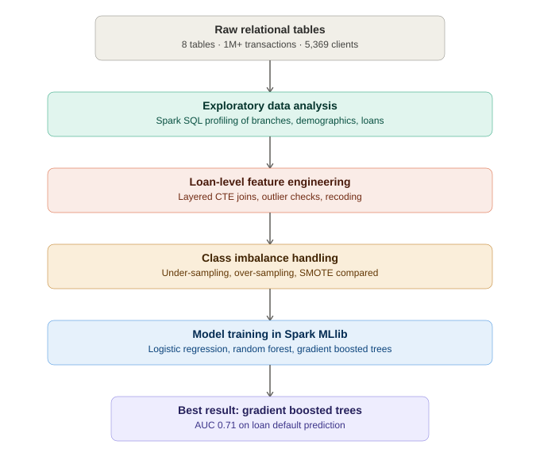

# 🏦 Banking Data Pipeline & Loan Default Prediction (PySpark)

End-to-end data engineering and machine learning pipeline built on a European retail banking dataset — 8 relational tables, 1M+ transactions, 5,369 clients, and 682 loans — engineered entirely in **PySpark** and **Spark SQL**.

The pipeline transforms raw, relational banking data into a single, ML-ready, loan-level dataset for predicting **loan default**, covering everything from schema design to model evaluation.

---

## 📌 Project Highlights

- Processed **1,056,320 transactions** across **4,500 accounts** and **5,369 clients** using distributed Spark DataFrames
- Engineered a loan-level feature set via layered CTEs joining 5 relational tables
- Handled severe class imbalance (606 non-defaulters vs. 76 defaulters) using under-sampling, over-sampling, and SMOTE
- Benchmarked 3 Spark MLlib classifiers, with **Gradient Boosted Trees achieving the best AUC (0.71)**

---

## 📂 Dataset

Sourced from a Czech retail bank (translated and adapted for this project), containing 8 CSV tables:

| Table | Records | Description |
|---|---|---|
| Account | 4,500 | Bank account metadata |
| Client | 5,369 | Customer demographics |
| Disposition | 5,369 | Client-to-account relationships |
| Order | 6,471 | Standing payment orders |
| Transaction | 1,056,320 | Full transaction history |
| Loan | 682 | Loan terms and status |
| Credit Card | 892 | Card ownership and type |
| District | 77 | Regional demographic/economic data |

---

## 🔧 Pipeline Overview



1. **Data Ingestion** — Loaded all 8 source tables into Spark DataFrames with schema inference and correct delimiters.
2. **Exploratory Data Analysis** — Branch-level customer counts, account growth trends, gender splits, card preferences by demographic, loan distributions, and salary/unemployment correlations (Spark SQL + Pandas/Matplotlib).
3. **Modeling Dataset Construction** — Joined loan → account → district → client → transaction aggregates into one loan-level table using layered CTEs.
4. **Preprocessing** — Missing value checks, duplicate detection, and grain validation (one row per `loan_id`).
5. **Outlier & Anomaly Detection** — IQR-based checks (via `percentile_approx`) across amount, payments, duration, salary, unemployment, crime rate, and transaction fields, plus checks for invalid/negative/zero values.
6. **Data Quality Review** — Flagged inconsistencies in historical crime-rate fields (A15/A16).
7. **Localization** — Recoded categorical fields (loan frequency, transaction type/operation) from Czech to English via SQL `CASE` statements.
8. **Feature Engineering** — Aggregated transaction-level data into account-level features (volume, amount stats, balance stats, credit/debit and withdrawal-type counts).
9. **Target Simplification** — Recast four-category loan status into a binary Defaulter / Non-defaulter label.
10. **Class Imbalance Handling** — Compared under-sampling, over-sampling, and SMOTE.
11. **Model Training** — Trained Logistic Regression, Random Forest, and Gradient Boosted Trees in Spark MLlib on an 80/20 split.
12. **Standardization Check** — Tested whether feature scaling improved Logistic Regression performance.

---

## 📊 Results

| Model | AUC |
|---|---|
| Logistic Regression | ~0.6x |
| Random Forest | ~0.6x |
| **Gradient Boosted Trees** | **0.71 (best)** |

Feature standardization showed no meaningful improvement on Logistic Regression, consistent with Spark ML's internal handling of feature scale.

---

## 🛠️ Tech Stack

- **PySpark** — DataFrame API + Spark SQL
- **Spark MLlib** — Logistic Regression, Random Forest, GBT, VectorAssembler, StandardScaler
- **Pandas / scikit-learn** — SMOTE, LabelEncoder
- **Matplotlib** — Visualization

---

## 🚧 Known Limitations & Next Steps

- SMOTE is currently applied *before* the train/test split and on a single feature (`amount`); a future iteration will apply balancing after the split and expand the feature set to include engineered transaction and district features.
- Under/over-sampling are computed for comparison but not yet carried through to model training.
- Evaluation currently reports AUC only — precision/recall/F1 on the minority (Defaulter) class would better reflect real-world misclassification cost.

---

## 📁 Repository Contents

```
├── dataset/                                                          # Source CSV tables
├── Banking_Data_Pipeline_&_Loan_Default_Feature_Engineering_PySpark.ipynb   # Full pipeline notebook
├── requirements.txt
└── LICENSE
```

---

## 👤 Author

**Nasiruddin Arif Bin Shar Sham**
Certified Enterprise Data Engineer (CADS AI)
[LinkedIn](https://www.linkedin.com/in/nasiruddinarif/)

---

## 📄 License

This project is licensed under the MIT License.


